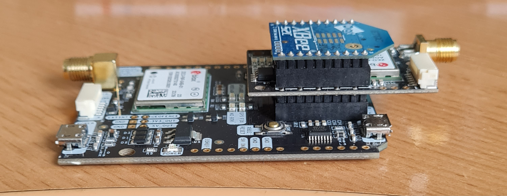
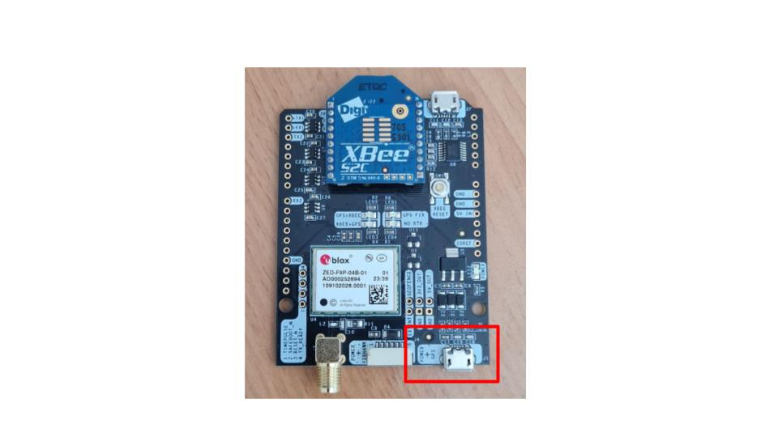
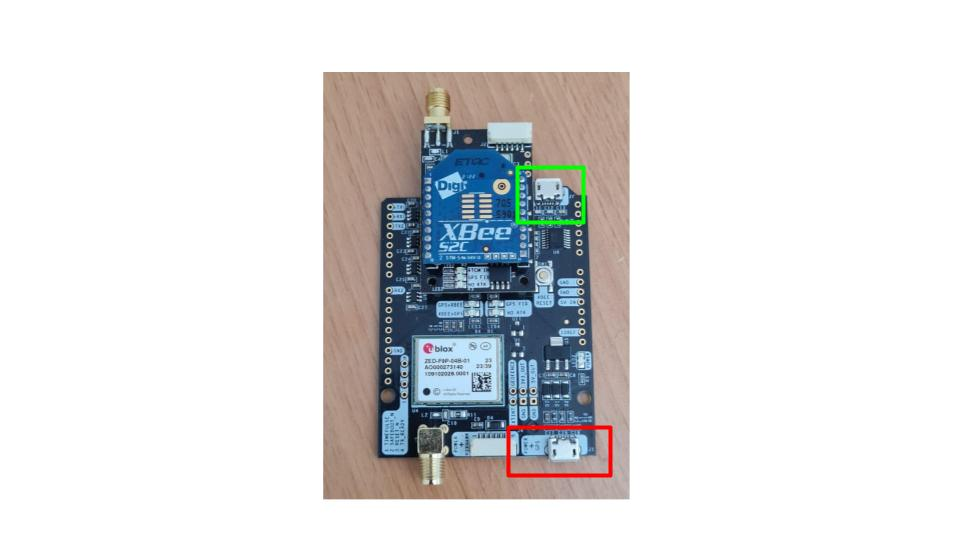
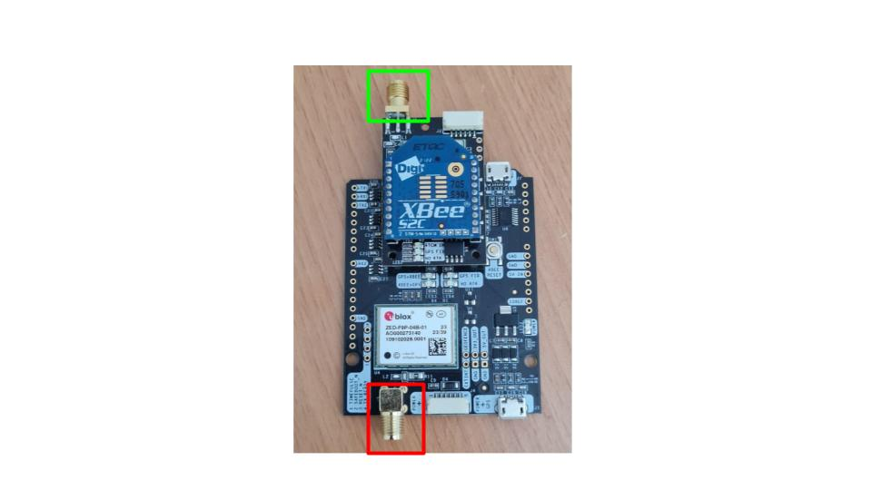

# GPS RTK

Ce projet a pour but de fournir la position et l'orientation d'un robot mobile utilisant les données d'un GPS RTK ardusimple rtk2b

### Hardware

* 2 simpleRTK2B Budget boards (ZED-F9P)
* 1 simpleRTK2B Lite board (ZED-F9P)
* 3 u-blox GNSS Multiband antenna ANN-MB-00
* 2 Radio Modules LR
* 2 cables micro-usb alimentation/transfert de données

### Fichiers de configuration

* Base
* 5Hz simpleRTK2Blite Heading kit Moving Base
* 5Hz simpleRTK2B Heading kit Rover

### Utilisation
#### Setup
Brancher la carte rtk2b lite sur la carte rtk2b budget qui servira de rover 

Si ce n'est pas déja le cas, il faut charger les bon fichier de configuration dans les cartes correspondantes.

* Le fichier Base dans la carte seule qui servira de base. Connexion via le port usb (power + gps).

* Le fichier 5Hz simpleRTK2Blite (Moving Base) dans la carte budget qui servira de rover.  Connexion via le port usb (power + gps/ en rouge).
* Le fichier 5Hz simpleRTK2B (Rover) dans la carte lite. Connexion via le deuxieme port usb de la carte budget rover(en vert).

* Le chargement de fichier dans les cartes se fait via le logiciel u-center.
[Tutoriel de la marque](https://www.ardusimple.com/configuration-files/)

Pour le rover, l'antenne se situant à l'avant du robot doit etre branchée sur la carte budget en rouge et l'antenne se situant à l'arrière doit etre branchée sur la carte lite(en vert).

Alimenter la base puis le rover via le port usb (power + gps) 

Avec le rover brancher au robot, dans le fichier /etc/udev/rules.d/50-ardusimple.rules, ajouter la ligne : KERNEL=="ttyACM[0-9]*", ATTRS{idVendor}=="1546", ATTRS{idProduct}=="01a9", SYMLINK="tty_Ardusimple_Rover", GROUP="dialout", MODE="0666"

#### Application pour visualisation des données

* Lancer ROS avec le fichier launch hector.launch 
* Lancer les scripts frame_change.py 1 et 2 (1 permet l'affichage de la pose/fleche, 2 permet le tracer de la trajectoire)
* Lancer Rviz
* Ajouter un display de type Pose sur le topic /gps_rover/fix
* Ajouter un display de type Path sur le topic /trajectory
* Lancer le script position_orientation.py
La position et l'orientation du robot devrait apparaitre sur Rviz

#### Potentiels problèmes 

* Le gps ne renvoie pas des messages NAV-PVT et NAV-RELPOSNED mais des messages NMEA
  
*disclaimer* ceci ne sont que des suppositions. Il est possible que le rover n'arrive pas à communiquer correctement avec la base, dans ce cas la éteindre les deux cartes, alimenter la base et attendre quelques minutes avant d'alimenter le rover permet généralement de régler le problème.

* La base n'obtient pas sa position en mode 'FIX' (mode avec la plus haute précision et necessaire pour les corrections RTK)

La base prend deux paramètre de configuration, le temps minimum d'analyse et le degré de précision minimum à atteindre. Il est possible de changer ces paramètres via u-center. Diminuer la precision minimale peut permettre de régler le problème. 
Les paramètres peuvent être changé sur u-center. En haut a gauche onglet view -> Configuration view sur la gauche dans le menu déroulant chercher TMODE (Time Mode) (il existe aussi TMODE2 et TMODE3), selctionner survey-in pour le time mode (dans le doute le faire sur les 3) puis appuyer sur send.

